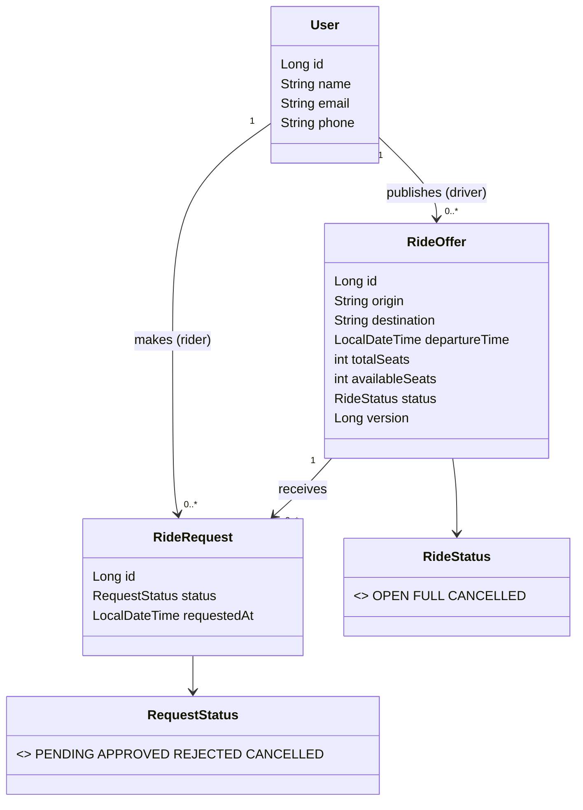
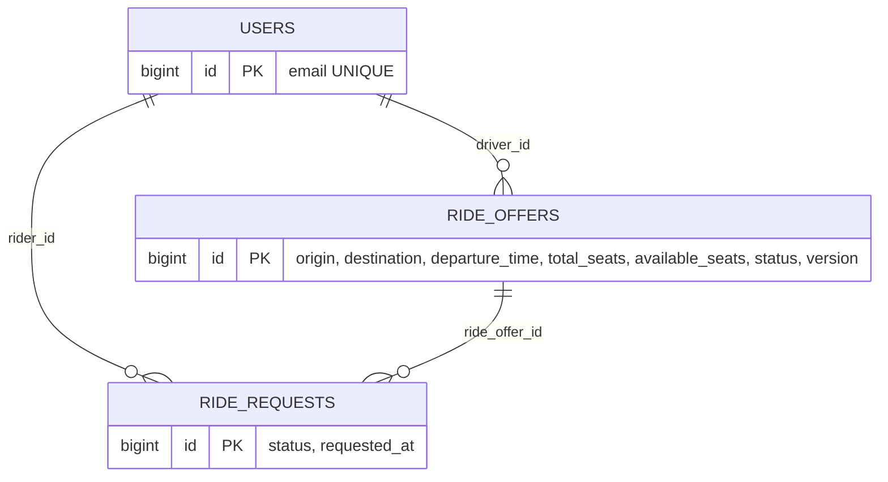
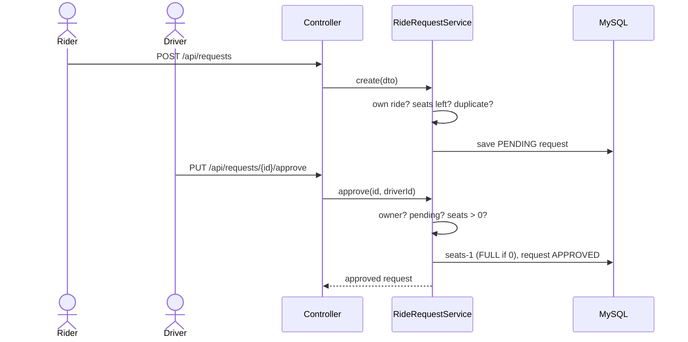

# RideShareLite — Office/College Carpool Matching Platform

Spring Boot 4 · Spring Data JPA · MySQL · Bean Validation · static HTML frontend.
Layered architecture: **Controller → Service (interface + impl) → Repository → Entity**, with a single `@RestControllerAdvice` for errors.

## Run
1. Install Java 17+, Maven, MySQL.
2. Edit the password in `src/main/resources/application.properties` (database `rideshare_lite` is created automatically).
3. `mvn spring-boot:run`
4. Open <http://localhost:8081> (UI) — or call the REST API with Postman/Swagger-style requests below.
5. Run the business-rule tests: `mvn test`

## Features → endpoints
| # | Feature | Endpoint |
|---|---------|----------|
| 1 | Driver publishes route, time, seats | `POST /api/rides` |
| 2 | Rider searches by route + time window | `GET /api/rides/search?origin=&destination=&from=&to=` |
| 3 | Rider requests a seat | `POST /api/requests` |
| 4 | Driver approves / rejects | `PUT /api/requests/{id}/approve?driverId=` · `/reject?driverId=` |
| 5 | Ride history (driver + rider) | `GET /api/users/{id}/history` |

Full CRUD as well: `/api/users` (POST, GET, GET/{id}, PUT/{id}, DELETE/{id}), `/api/rides` (GET, GET/{id}, PUT/{id}, `DELETE/{id}?driverId=` = soft cancel), `PUT /api/requests/{id}/cancel?riderId=`.

## Business rules (enforced in the service layer)
| Rule | Where | HTTP result |
|------|-------|-------------|
| A ride request cannot be approved if no seats remain | `RideRequestServiceImpl.approve` | 422 "Cannot approve: no seats remaining" |
| A user cannot request a seat on their own ride | `RideRequestServiceImpl.create` | 422 |
| Request on a full / cancelled / departed ride is rejected immediately | `RideRequestServiceImpl.create` | 422 "No seats remaining on this ride" |
| Duplicate active request for the same ride | `create` | 409 |
| Only the driver approves/rejects; only the rider cancels | `requireDriver`, `cancel` | 403 |
| Concurrent approvals can't oversell a seat | `@Version` on `RideOffer` | 409 |

## Sample requests
```json
POST /api/users
{ "name": "Anu", "email": "anu@college.edu", "phone": "9876543210" }

POST /api/rides
{ "driverId": 1, "origin": "Gandhipuram", "destination": "College",
  "departureTime": "2026-10-01T08:00:00", "totalSeats": 3 }

POST /api/requests
{ "riderId": 2, "rideOfferId": 1 }

PUT /api/requests/1/approve?driverId=1
```
Error shape (all endpoints):
```json
{ "timestamp": "...", "status": 422, "error": "Unprocessable Entity",
  "message": "You cannot request a seat on your own ride", "path": "/api/requests", "details": [] }
```

## UML

### Class diagram


### ER diagram


### Sequence — request and approve a seat


## Project layout
```
model/       User, RideOffer, RideRequest, RideStatus, RequestStatus
repository/  UserRepository, RideOfferRepository (search query), RideRequestRepository
service/     *Service interfaces + *ServiceImpl (business rules)
controller/  UserController, RideOfferController, RideRequestController
dto/         RideOfferRequest, RideRequestCreate, RideHistoryResponse
exception/   GlobalExceptionHandler + custom exceptions + ErrorResponse
static/      index.html (single-page demo UI)
```
